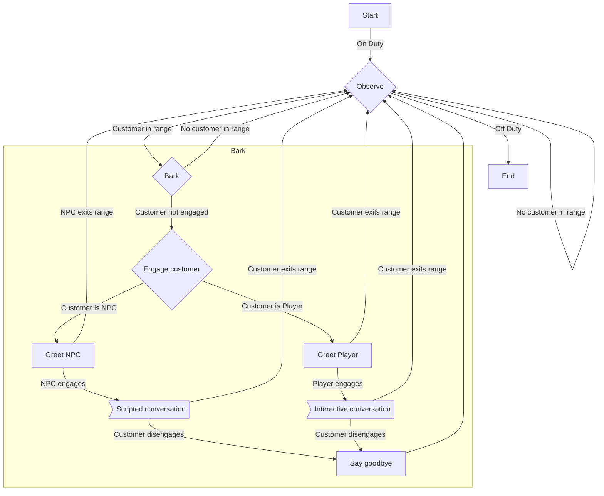

# gohtn

a golang implementation of an HTN execution engine 

## Background

The goal of this project is to construct an orchestration and execution logic framework that executes a hierarchical task network.

The HTN used is intentionally oversimplified in favor of stronger orchestration and execution logic.  As such the network used for testing performs no useful tasks.

## Implementation

The current implementation contains the following simplifications:
1. Sensors are modelled as simple 64 bit floating point values.
2. State properties are a simple pass-through to the sensors.  This allows for easy testing of control flow and evaluation.
3. The HTN implemented for testing purposes is heavily oversimplified and uses primitive flags and value checking as preconditions.

Supported tasks:
- Primitive tasks with multiple conditions.  The task will execute when all conditions are met
- Compound tasks with multiple methods.  Each method is a set of conditions and tasks, and the compound task selects and executes a method given the state. Compound tasks allow for hierarchical topology.
- Goal tasks with multiple task conditions.  A task condition is a condition that is satisfied when a task completes. The goal is met when all task conditions are satisfied.

References:
- https://en.wikipedia.org/wiki/Hierarchical_task_network
- https://www.gameaipro.com/GameAIPro/GameAIPro_Chapter12_Exploring_HTN_Planners_through_Example.pdf

## Example

The example used emulates a simple interaction with a vendor that follows a basic set of rules:
1. The vendor starts off duty
2. The vendor goes on-duty at a specific time
3. When on duty, the vendor observe its surroundings.  They take no action if there are no customers in range.
4. If a customer enters range and are not already engaged in conversation, the vendor attempts to lure them in.
5. If the customer is an NPC the vendor behavior forks to select from the ambient speech options
6. If the customer is a player the vendor behavior forks to select the interactive speech options
7. If the customer leaves range or exits the conversation, the vendor says goodbye and returns to observation mode
8. At a specific time the vendor goes off duty

